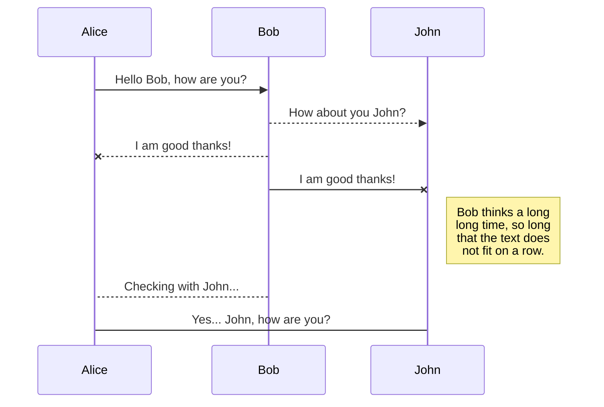
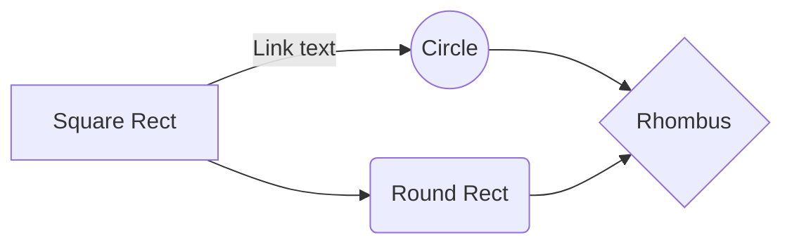

## Esengo Food Trading Platform

**Imagine being a farmer:** The early mornings, the backbreaking labor, and the hope that your sweat and toil will yield enough to support your family. Now, imagine doing all of this without knowing whether you'll find buyers, secure finance, or even know what to plant and when. That's the reality for millions of small-scale farmers worldwide, and it's a problem begging for a solution.

**The Problem**: Small-scale farmers often face a daunting challenge – the lack of access to crucial resources and information. They struggle to secure the financing needed to invest in their crops, grapple with uncertainty about market demand, and face the constant dilemma of what to grow and when. In this complex web, they're often left at the mercy of middlemen who take significant shares of their hard-earned profits.

**Our Vision:** At Esengo, we're driven by a vision of empowerment. We envision a world where farmers don't just have the tools and knowledge to thrive. But to actively help farming in general, to become more (financially, ecologically and logistically) sustainable, by doing only one thing. To make the farming "game" fair; And it's not necessarily about higher prices; It's about moving barriers, gaining honestly and allowing people to compete on secondary factors (production method, distance, Emissions, water-usage, reputation)  as well as the main one.   We're not just developing an app; we're cultivating a movement. A movement that provides farmers with the vital resources, information, and connections they need to break free from the cycle of uncertainty and financial instability. 

**The Esengo Solution:** Picture an app that becomes your farming ally. Esengo-ID isn't just about helping tracing your food's journey; it's about transforming the way farmers do business. It connects them with buyers, helping them secure fair prices and create stable incomes. It helps deal with logistical transport, it helps them to plan for the next season, it allows them to ask for loans and funding, and it helps them find the right things to do. With the Esengo Trading Platform, farmers can discover what crops are in demand and when, so they can make informed decisions. It's like having a digital partner to navigate the complexities of farming in the modern world.

**Why Esengo Matters**: We're passionate about leveling the playing field for small-scale farmers. By reducing uncertainty, providing access to markets, and fostering financial stability, we're changing lives. Imagine a world where farmers don't just survive but thrive, where they can confidently plant their seeds, secure their finances, and connect with buyers who value their hard work.

**Join the Movement:** We're not merely seeking partners; we're building a community of visionaries who believe in a fairer, more sustainable future for farmers. Together, we can transform the challenges faced by small-scale farmers into opportunities for growth and prosperity. Join us on this remarkable journey to empower farmers, secure our food supply, and create a brighter future for all. Esengo: Empowering Farmers for a Fairer Future

## Project: Esengo Food Trading Platform 

| Objective |
| --- |
| Launch and grow Esengo Food Trading Platform as a disruptive solution for the food industry. |

### Strategies
| Strategy  | Description |
| --- | --- |
| 1. Prototype Deployment | Take a minimal version of the program that could already be usefull now, and gather feedback around it |
| 2. Client Acquisition | Identify and engage with early adopters and potential clients. |
| 3. Brand Awareness | Increase visibility and credibility in the food industry by creating a community-like athmosphere |
| 4. Product Validation | Test the market and validate the platform's value proposition, by first simulation and then deployment |
| 5. Research and Data Gathering | Explore research opportunities to gain deeper insights into the food industry and user behavior. |

### Goals
| Strategy | Goals |
| --- | --- |
| Prototype Refinement | - Gather user feedback and implement at least two significant improvements per month. |
| Client Acquisition | - Acquire 10 pilot clients within the first six months. |
| Brand Awareness | - Generate awareness through social media and industry events. Hold a minimum of 2 events|
| Product Validation | - Secure initial partnerships with local farmers and traders. |
| Research and Data Gathering | - Conduct at least two research studies on food industry trends and user behavior in the first year. |

### Measures (KPIs)
| Strategy | Goals | Measures |
| --- | --- | --- |
| Prototype Refinement | - Gather user feedback and implement at least two significant improvements per month. | - Number of user feedback submissions.   - number of Sprint points collected. |
| Client Acquisition | - Acquire 10 pilot clients within the first six months. | - Number of signed pilot agreements.   - Conversion rate of leads to clients. |
| Brand Awareness | - Generate awareness through social media and industry events. | - Social media engagement metrics (likes, shares, comments).   - Number of attendees at industry events. |
| Product Validation | - Secure initial partnerships with local farmers and traders. | - Number of signed partnership agreements.   - Feedback from pilot partners. |
| Research and Data Gathering | - Conduct at least two research studies on food industry trends and user behavior in the first year. | - Number of research reports published.   - User surveys conducted. |

**Esengo's Money Machine: Empowering Farmers, Enabling Growth**

At Esengo, our mission isn't just about making profits; it's about creating a sustainable and equitable ecosystem for farmers. To achieve this, we've developed a robust business model that aligns our success with the success of the farmers and supply chain participants we serve.

**1. Subscription Model:** Farmers are the heart of our platform. To access the full suite of Esengo-ID and Esengo Trading Platform features, farmers can subscribe to our services at a reasonable monthly fee. This model ensures that we remain accessible to even the smallest of farmers while providing a stable revenue stream. This subscription fee is done in the form of a token, which will be given to farmers at their initial start. 

**2. Marketplace Transaction Fees:** For every successful transaction facilitated through the Esengo Trading Platform, we charge a small transaction fee. This fee ensures that we remain financially sustainable while incentivizing the use of our platform for trade.

**3. Data Insights and Analytics:** Our platform collects vast amounts of data regarding crop trends, market demand, and supply chain dynamics. Aggregated and anonymized, this data holds tremendous value for agricultural businesses, policymakers, and researchers. We offer subscription-based access to these insights, creating an additional revenue stream.

**4. Partner Collaborations:** We collaborate with various partners in the agricultural and technology sectors. These collaborations can take the form of joint ventures, co-development projects, or data-sharing agreements, creating opportunities for revenue generation while expanding our reach.

**5. Grants and Impact Investment:** As we're dedicated to addressing global food security and empowering farmers, we actively seek grants and impact investment opportunities from organizations, governments, and institutions aligned with our mission.

**6. Value-Added Services:** Beyond our core offerings, we explore opportunities to provide value-added services to farmers, such as access to finance, training modules, or premium market insights, offered on a fee basis.

**7. Scaling Across Borders:** While initially focused on European and African markets, Esengo's platform is scalable worldwide. As we expand our footprint, we will adapt our revenue model to fit the unique needs and conditions of each region.

## KaTeX

-   **cash-to-Cash Cycle Time (C2C)**:
    
    -   Measures the time it takes for a company to convert its investments in inventory and other resources into cash flow from sales.
    -   Formula: C2C=DIO+DSO−DPOC2C=DIO+DSO−DPO
        -   DIO (Days Inventory Outstanding): Average number of days it takes to sell inventory.
        -   DSO (Days Sales Outstanding): Average number of days it takes to collect payment from customers.
        -   DPO (Days Payables Outstanding): Average number of days it takes to pay suppliers.
-   **Working Capital Ratio**:
    
    -   Measures a company's operational efficiency and short-term financial health.
    -   Formula: Working Capital Ratio=Current AssetsCurrent LiabilitiesWorkingCapitalRatio=CurrentLiabilitiesCurrentAssets​
-   **Cash Conversion Cycle (CCC)**:
    
    -   A variation of the C2C that includes the time it takes to pay suppliers and considers the entire cash flow cycle.
    -   Formula: CCC=DIO+DSO−DPOCCC=DIO+DSO−DPO
-   **Inventory Turnover**:
    
    -   Measures how efficiently a company manages its inventory.
    -   Formula: Inventory Turnover=Cost of Goods SoldAverage InventoryInventoryTurnover=AverageInventoryCostofGoodsSold​
-   **Accounts Receivable Turnover**:
    
    -   Measures how quickly a company collects payments from customers.
    -   Formula: Accounts Receivable Turnover=Net SalesAverage Accounts ReceivableAccountsReceivableTurnover=AverageAccountsReceivableNetSales​
-   **Accounts Payable Turnover**:
    
    -   Measures how quickly a company pays its suppliers.
    -   Formula: Accounts Payable Turnover=Cost of Goods SoldAverage Accounts PayableAccountsPayableTurnover=AverageAccountsPayableCostofGoodsSold​

You can render LaTeX mathematical expressions using [KaTeX](https://khan.github.io/KaTeX/):

The *Gamma function* satisfying $\Gamma(n) = (n-1)!\quad\forall n\in\mathbb N$ is via the Euler integral

$$
\Gamma(z) = \int_0^\infty t^{z-1}e^{-t}dt\,.
$$

> You can find more information about **LaTeX** mathematical expressions [here](http://meta.math.stackexchange.com/questions/5020/mathjax-basic-tutorial-and-quick-reference).

## UML diagrams

You can render UML diagrams using [Mermaid](https://mermaidjs.github.io/). For example, this will produce a sequence diagram:

And this will produce a flow chart:

<!--stackedit_data:
eyJoaXN0b3J5IjpbLTE4NDc5OTY1NzUsLTE1MDg1NDQyNzksLT
ExNzYyMDA1ODddfQ==
-->