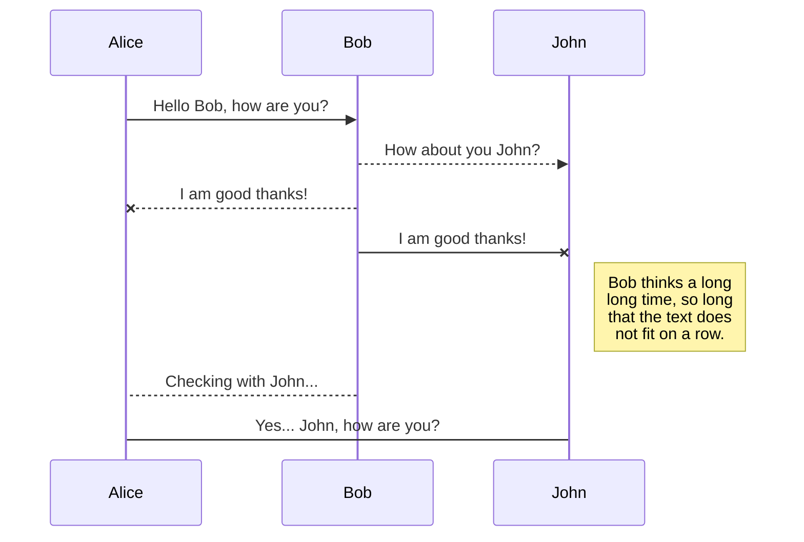
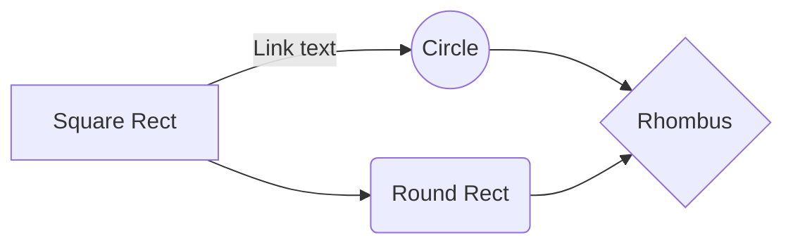

## Esengo Food Trading Platform

**Imagine being a farmer:** The early mornings, the backbreaking labor, and the hope that your sweat and toil will yield enough to support your family. Now, imagine doing all of this without knowing whether you'll find buyers, secure finance, or even know what to plant and when. That's the reality for millions of small-scale farmers worldwide, and it's a problem begging for a solution.

**The Problem**: Small-scale farmers often face a daunting challenge – the lack of access to crucial resources and information. They struggle to secure the financing needed to invest in their crops, grapple with uncertainty about market demand, and face the constant dilemma of what to grow and when. In this complex web, they're often left at the mercy of middlemen who take significant shares of their hard-earned profits.

**Our Vision:** At Esengo, we're driven by a vision of empowerment. We envision a world where farmers don't just have the tools and knowledge to thrive. But to actively help farming in general, to become more (financially, ecologically and logistically) sustainable, by doing only one thing. To make the farming "game" fair; And it's not necessarily about higher prices; It's about moving barriers, gaining honestly and allowing people to compete on secondary factors (production method, distance, Emissions, water-usage, reputation)  as well as the main one.   We're not just developing an app; we're cultivating a movement. A movement that provides farmers with the vital resources, information, and connections they need to break free from the cycle of uncertainty and financial instability. 

**The Esengo Solution:** Picture an app that becomes your farming ally. Esengo-ID isn't just about helping tracing your food's journey; it's about transforming the way farmers do business. It connects them with buyers, helping them secure fair prices and create stable incomes. It helps deal with logistical transport, it helps them to plan for the next season, it allows them to ask for loans and funding, and it helps them find the right things to do. With the Esengo Trading Platform, farmers can discover what crops are in demand and when, so they can make informed decisions. It's like having a digital partner to navigate the complexities of farming in the modern world.

**Why Esengo Matters**: We're passionate about leveling the playing field for small-scale farmers. By reducing uncertainty, providing access to markets, and fostering financial stability, we're changing lives. Imagine a world where farmers don't just survive but thrive, where they can confidently plant their seeds, secure their finances, and connect with buyers who value their hard work.

**Join the Movement:** We're not merely seeking partners; we're building a community of visionaries who believe in a fairer, more sustainable future for farmers. Together, we can transform the challenges faced by small-scale farmers into opportunities for growth and prosperity. Join us on this remarkable journey to empower farmers, secure our food supply, and create a brighter future for all. Esengo: Empowering Farmers for a Fairer Future

## Project: Esengo Food Trading Platform 

| Objective |
| --- |
| Launch and grow Esengo Food Trading Platform as a disruptive solution for the food industry. |

### Strategies
| Strategy  | Description |
| --- | --- |
| 1. Prototype Deployment | Take a minimal version of the program that could already be usefull now, and gather feedback around it |
| 2. Client Acquisition | Identify and engage with early adopters and potential clients. |
| 3. Brand Awareness | Increase visibility and credibility in the food industry by creating a community-like athmosphere |
| 4. Product Validation | Test the market and validate the platform's value proposition, by first simulation and then deployment |
| 5. Research and Data Gathering | Explore research opportunities to gain deeper insights into the food industry and user behavior. |

### Goals
| Strategy | Goals |
| --- | --- |
| Prototype Refinement | - Gather user feedback and implement at least two significant improvements per month. |
| Client Acquisition | - Acquire 10 pilot clients within the first six months. |
| Brand Awareness | - Generate awareness through social media and industry events. Hold a minimum of 2 events|
| Product Validation | - Secure initial partnerships with local farmers and traders. |
| Research and Data Gathering | - Conduct at least two research studies on food industry trends and user behavior in the first year. |

### Measures (KPIs)
| Strategy | Goals | Measures |
| --- | --- | --- |
| Prototype Refinement | - Gather user feedback and implement at least two significant improvements per month. | - Number of user feedback submissions.   - number of Sprint points collected. |
| Client Acquisition | - Acquire 10 pilot clients within the first six months. | - Number of signed pilot agreements.   - Conversion rate of leads to clients. |
| Brand Awareness | - Generate awareness through social media and industry events. | - Social media engagement metrics (likes, shares, comments).   - Number of attendees at industry events. |
| Product Validation | - Secure initial partnerships with local farmers and traders. | - Number of signed partnership agreements.   - Feedback from pilot partners. |
| Research and Data Gathering | - Conduct at least two research studies on food industry trends and user behavior in the first year. | - Number of research reports published.   - User surveys conducted. |

**Esengo's Money Machine: Empowering Farmers, Enabling Growth**

At Esengo, our mission isn't just about making profits; it's about creating a sustainable and equitable ecosystem for farmers. To achieve this, we've developed a robust business model that aligns our success with the success of the farmers and supply chain participants we serve.

**1. Subscription Model:** Farmers are the heart of our platform. To access the full suite of Esengo-ID and Esengo Trading Platform features, farmers can subscribe to our services at a reasonable monthly fee. This model ensures that we remain accessible to even the smallest of farmers while providing a stable revenue stream. This subscription fee is done in the form of a token, which will be given to farmers at their initial start. 

**2. Marketplace Transaction Fees:** For every successful transaction facilitated through the Esengo Trading Platform, we charge a small transaction fee. This fee ensures that we remain financially sustainable while incentivizing the use of our platform for trade.

**3. Data Insights and Analytics:** Our platform collects vast amounts of data regarding crop trends, market demand, and supply chain dynamics. Aggregated and anonymized, this data holds tremendous value for agricultural businesses, policymakers, and researchers. We offer subscription-based access to these insights, creating an additional revenue stream.

**4. Partner Collaborations:** We collaborate with various partners in the agricultural and technology sectors. These collaborations can take the form of joint ventures, co-development projects, or data-sharing agreements, creating opportunities for revenue generation while expanding our reach.

**5. Grants and Impact Investment:** As we're dedicated to addressing global food security and empowering farmers, we actively seek grants and impact investment opportunities from organizations, governments, and institutions aligned with our mission.

**6. Value-Added Services:** Beyond our core offerings, we explore opportunities to provide value-added services to farmers, such as access to finance, training modules, or premium market insights, offered on a fee basis.

**7. Scaling Across Borders:** While initially focused on European and African markets, Esengo's platform is scalable worldwide. As we expand our footprint, we will adapt our revenue model to fit the unique needs and conditions of each region.

# Synchronization

Synchronization is one of the biggest features of StackEdit. It enables you to synchronize any file in your workspace with other files stored in your **Google Drive**, your **Dropbox** and your **GitHub** accounts. This allows you to keep writing on other devices, collaborate with people you share the file with, integrate easily into your workflow... The synchronization mechanism takes place every minute in the background, downloading, merging, and uploading file modifications.

There are two types of synchronization and they can complement each other:

- The workspace synchronization will sync all your files, folders and settings automatically. This will allow you to fetch your workspace on any other device.
	> To start syncing your workspace, just sign in with Google in the menu.

- The file synchronization will keep one file of the workspace synced with one or multiple files in **Google Drive**, **Dropbox** or **GitHub**.
	> Before starting to sync files, you must link an account in the **Synchronize** sub-menu.

## Open a file

You can open a file from **Google Drive**, **Dropbox** or **GitHub** by opening the **Synchronize** sub-menu and clicking **Open from**. Once opened in the workspace, any modification in the file will be automatically synced.

## Save a file

You can save any file of the workspace to **Google Drive**, **Dropbox** or **GitHub** by opening the **Synchronize** sub-menu and clicking **Save on**. Even if a file in the workspace is already synced, you can save it to another location. StackEdit can sync one file with multiple locations and accounts.

## Synchronize a file

Once your file is linked to a synchronized location, StackEdit will periodically synchronize it by downloading/uploading any modification. A merge will be performed if necessary and conflicts will be resolved.

If you just have modified your file and you want to force syncing, click the **Synchronize now** button in the navigation bar.

> **Note:** The **Synchronize now** button is disabled if you have no file to synchronize.

## Manage file synchronization

Since one file can be synced with multiple locations, you can list and manage synchronized locations by clicking **File synchronization** in the **Synchronize** sub-menu. This allows you to list and remove synchronized locations that are linked to your file.

# Publication

Publishing in StackEdit makes it simple for you to publish online your files. Once you're happy with a file, you can publish it to different hosting platforms like **Blogger**, **Dropbox**, **Gist**, **GitHub**, **Google Drive**, **WordPress** and **Zendesk**. With [Handlebars templates](http://handlebarsjs.com/), you have full control over what you export.

> Before starting to publish, you must link an account in the **Publish** sub-menu.

## Publish a File

You can publish your file by opening the **Publish** sub-menu and by clicking **Publish to**. For some locations, you can choose between the following formats:

- Markdown: publish the Markdown text on a website that can interpret it (**GitHub** for instance),
- HTML: publish the file converted to HTML via a Handlebars template (on a blog for example).

## Update a publication

After publishing, StackEdit keeps your file linked to that publication which makes it easy for you to re-publish it. Once you have modified your file and you want to update your publication, click on the **Publish now** button in the navigation bar.

> **Note:** The **Publish now** button is disabled if your file has not been published yet.

## Manage file publication

Since one file can be published to multiple locations, you can list and manage publish locations by clicking **File publication** in the **Publish** sub-menu. This allows you to list and remove publication locations that are linked to your file.

# Markdown extensions

StackEdit extends the standard Markdown syntax by adding extra **Markdown extensions**, providing you with some nice features.

> **ProTip:** You can disable any **Markdown extension** in the **File properties** dialog.

## SmartyPants

SmartyPants converts ASCII punctuation characters into "smart" typographic punctuation HTML entities. For example:

|                |ASCII                          |HTML                         |
|----------------|-------------------------------|-----------------------------|
|Single backticks|`'Isn't this fun?'`            |'Isn't this fun?'            |
|Quotes          |`"Isn't this fun?"`            |"Isn't this fun?"            |
|Dashes          |`-- is en-dash, --- is em-dash`|-- is en-dash, --- is em-dash|

## KaTeX

You can render LaTeX mathematical expressions using [KaTeX](https://khan.github.io/KaTeX/):

The *Gamma function* satisfying $\Gamma(n) = (n-1)!\quad\forall n\in\mathbb N$ is via the Euler integral

$$
\Gamma(z) = \int_0^\infty t^{z-1}e^{-t}dt\,.
$$

> You can find more information about **LaTeX** mathematical expressions [here](http://meta.math.stackexchange.com/questions/5020/mathjax-basic-tutorial-and-quick-reference).

## UML diagrams

You can render UML diagrams using [Mermaid](https://mermaidjs.github.io/). For example, this will produce a sequence diagram:

And this will produce a flow chart:

<!--stackedit_data:
eyJoaXN0b3J5IjpbLTExNzYyMDA1ODddfQ==
-->