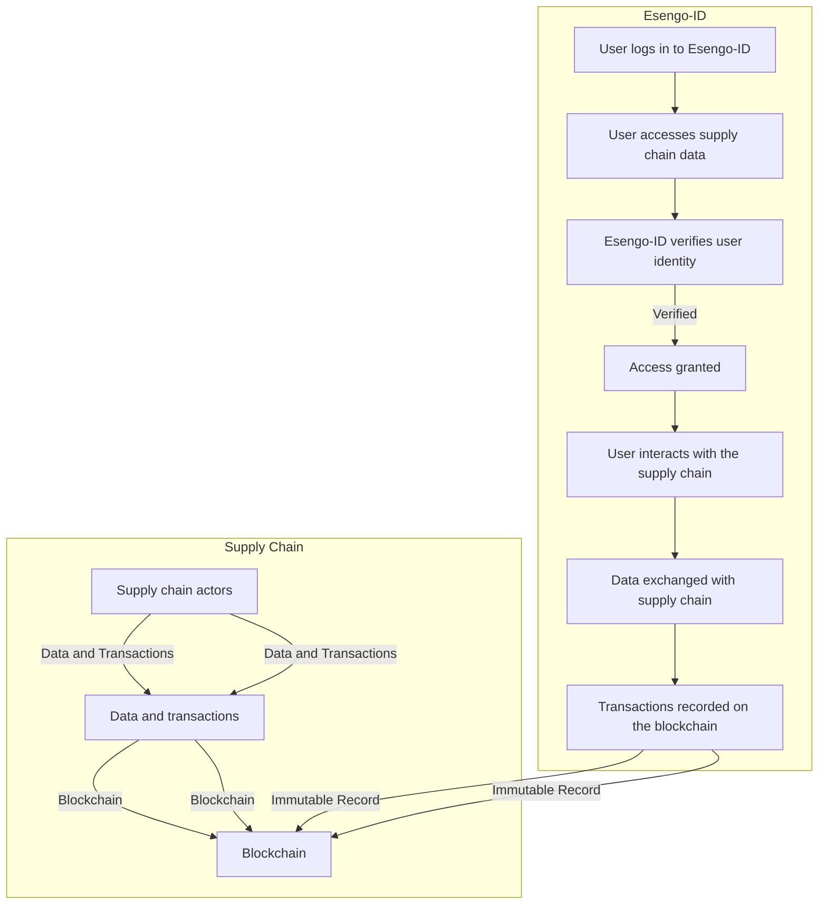

## Esengo Food Trading Platform
Imagine being a farmer: The early mornings, the backbreaking labor, and the hope that your sweat and toil will yield enough to support your family. Now, imagine doing all of this without knowing whether you'll find buyers, secure finance, or even know what to plant and when. That's the reality for millions of small-scale farmers worldwide, and it's a problem begging for a solution.

**The Problem:** Small-scale farmers often face a daunting challenge – the lack of access to crucial resources and information. They struggle to secure the financing needed to invest in their crops, grapple with uncertainty about market demand, and face the constant dilemma of what to grow and when. In this complex web, they're often left at the mercy of middlemen who take significant shares of their hard-earned profits. The problem is simple in nature, but hard in practice: It’s very difficult to farm, when you don’t know what people want, how much it should cost and when they would want it. This gets compounded, with additional things like carbon emissions, certification requirements, transparency and sustainability, as farmers have almost no metric to compete on besides Kilo / Quality per product.

**Our Vision:** At Esengo, we're driven by a vision of empowerment. We envision a world where every farmer has the tools and knowledge to thrive. We're not just developing an app; we're cultivating a movement. A movement that provides farmers with the vital resources, information, and connections they need to break free from the cycle of uncertainty and financial instability.

**The Esengo Solution:** Picture an app that becomes your farming ally. Esengo-ID isn't just about tracing your food's journey; it's about transforming the way farmers do business. It connects them with buyers, helping them secure fair prices and create stable incomes. With the Esengo Trading Platform, farmers can discover what crops are in demand and when, so they can make informed decisions. It's like having a digital partner to navigate the complexities of farming in the modern world.

To make this financially viable we have Marketplace Transaction Fees, a subscription Model and other value-adding features with a focus on Data Insights and Analytics and (cryptographic) Escrow services. These fees and subscription models are created in such a way that the first mile pays nothing or close to nothing for these services, incentivising usage.

**Market Opportunity:** Small-scale farmers represent a colossal market opportunity. Globally, they make up more than 90% of all farms and produce about 80% of the world's food. In Africa alone, smallholder farmers account for nearly 70% of the population and constitute a vital economic force. Yet, they face enormous challenges, with over 80% living below the poverty line, struggling to access finance, and battling crop loss due to insufficient information and support.

The digital transformation of agriculture is well underway, with the global smart agriculture market expected to grow to $23.2 billion by 2025. This growth highlights a substantial demand for technology-driven solutions that can enhance efficiency and profitability in the agriculture sector.

Esengo is uniquely positioned to tap into this massive market. By providing farmers with essential resources, data-driven insights, and direct access to buyers, we empower them to boost their yields and income. As we bring these advantages to small-scale farmers across Africa and beyond, we aim to be at the forefront of driving positive change in the agricultural industry.

Unique Advantage: Esengo's unique advantage lies in its client-centric approach and the integration of Verifiable Credentials (VCs) into its core functionalities. Unlike traditional supply chain solutions, Esengo prioritises the individual user, allowing them to maintain control over their identity and data. This empowers users to engage confidently in supply chain transactions while ensuring their privacy and security, without revealing their internal business operations. This unique feature makes Esengo the only initiative worldwide that wants the supply chain to stay siloed, working with the current supply chain process and incentives instead of going against it.

The incorporation of VCs enhances trust and transparency within the supply chain. Users can securely exchange information and credentials, such as product certifications or transaction records, with ease. This not only streamlines business processes but also fosters trust among stakeholders.

Esengo also stands out for its use of the Dutch auction system in the Esengo Platform, enabling fair and efficient trades between users who may not have prior trust relationships. This innovation opens up new opportunities for local-to-local trading and strengthens community ties within the supply chain.

## Project: Esengo Food Trading Platform 

| Objective |
| --- |
| Launch and grow Esengo Food Trading Platform as a disruptive solution for the food industry. |

### Strategies
| Strategy  | Description |
| --- | --- |
| 1. Prototype Deployment | Take a minimal version of the program that could already be usefull now, and gather feedback around it |
| 2. Client Acquisition | Identify and engage with early adopters and potential clients. |
| 3. Brand Awareness | Increase visibility and credibility in the food industry by creating a community-like athmosphere |
| 4. Product Validation | Test the market and validate the platform's value proposition, by first simulation and then deployment |
| 5. Research and Data Gathering | Explore research opportunities to gain deeper insights into the food industry and user behavior. |

### Goals
| Strategy | Goals |
| --- | --- |
| Prototype Refinement | - Gather user feedback and implement at least two significant improvements per month. |
| Client Acquisition | - Acquire 10 pilot clients within the first six months. |
| Brand Awareness | - Generate awareness through social media and industry events. Hold a minimum of 2 events|
| Product Validation | - Secure initial partnerships with local farmers and traders. |
| Research and Data Gathering | - Conduct at least two research studies on food industry trends and user behavior in the first year. |

### Measures (KPIs)
| Strategy | Goals | Measures |
| --- | --- | --- |
| Prototype Refinement | - Gather user feedback and implement at least two significant improvements per month. | - Number of user feedback submissions. <br> - number of Sprint points collected. |
| Client Acquisition | - Acquire 10 pilot clients within the first six months. | - Number of signed pilot agreements. <br> - Conversion rate of leads to clients. |
| Brand Awareness | - Generate awareness through social media and industry events. | - Social media engagement metrics (likes, shares, comments). <br> - Number of attendees at industry events. |
| Product Validation | - Secure initial partnerships with local farmers and traders. | - Number of signed partnership agreements. <br> - Feedback from pilot partners. |
| Research and Data Gathering | - Conduct at least two research studies on food industry trends and user behavior in the first year. | - Number of research reports published. <br> - User surveys conducted. |


**Esengo's Money Machine: Empowering Farmers, Enabling Growth**

At Esengo, our mission isn't just about making profits; it's about creating a sustainable and equitable ecosystem for farmers. To achieve this, we've developed a robust business model that aligns our success with the success of the farmers and supply chain participants we serve.

**1. Subscription Model:** Farmers are the heart of our platform. To access the full suite of Esengo-ID and Esengo Trading Platform features, farmers can subscribe to our services at a reasonable monthly fee. This model ensures that we remain accessible to even the smallest of farmers while providing a stable revenue stream. This subscription fee is done in the form of a token, which will be given to farmers at their initial start. 

**2. Marketplace Transaction Fees:** For every successful transaction facilitated through the Esengo Trading Platform, we charge a small transaction fee. This fee ensures that we remain financially sustainable while incentivizing the use of our platform for trade. This is also supplied with a token, which the farmers generate by creating new products. 

**3. Data Insights and Analytics:** Our platform collects vast amounts of data regarding crop trends, market demand, and supply chain dynamics. Aggregated and anonymized, this data holds tremendous value for agricultural businesses, policymakers, and researchers. We offer subscription-based access to these insights, creating an additional revenue stream.

**4. Partner Collaborations:** We collaborate with various partners in the agricultural and technology sectors. These collaborations can take the form of joint ventures, co-development projects, or data-sharing agreements, creating opportunities for revenue generation while expanding our reach.

**5. Grants and Impact Investment:** As we're dedicated to addressing global food security and empowering farmers, we actively seek grants and impact investment opportunities from organizations, governments, and institutions aligned with our mission.

For Grants we are currently looking at:
https://github.com/kamitor/EsengoFood/blob/master/Grants%20Esengo.md

**6. Value-Added Services:** Beyond our core offerings, we explore opportunities to provide value-added services to farmers, such as access to finance, training modules, or premium market insights, offered on a fee basis.

**7. Scaling Across Borders:** While initially focused on European and African markets, Esengo's platform is scalable worldwide. As we expand our footprint, we will adapt our revenue model to fit the unique needs and conditions of each region.

## Research Topics
 
 ## ESENGO Designs
 https://www.figma.com/file/6Dub7nc1xbZrWHwCV2pIc7/Esengo?type=design&node-id=0-1&mode=design&t=JxVBmrsWNogcM7B6-0


## Esengo working diagrams
Detailed below is how the system will function




```

<!--stackedit_data:
eyJoaXN0b3J5IjpbLTYzNjI4NDYzNiw3NTE1MDQ1NDksLTEyOT
A3OTIxNTksNjM5MzE0NTE0LDg3NDUxMjQ2MiwtMTUwODU0NDI3
OSwtMTE3NjIwMDU4N119
-->